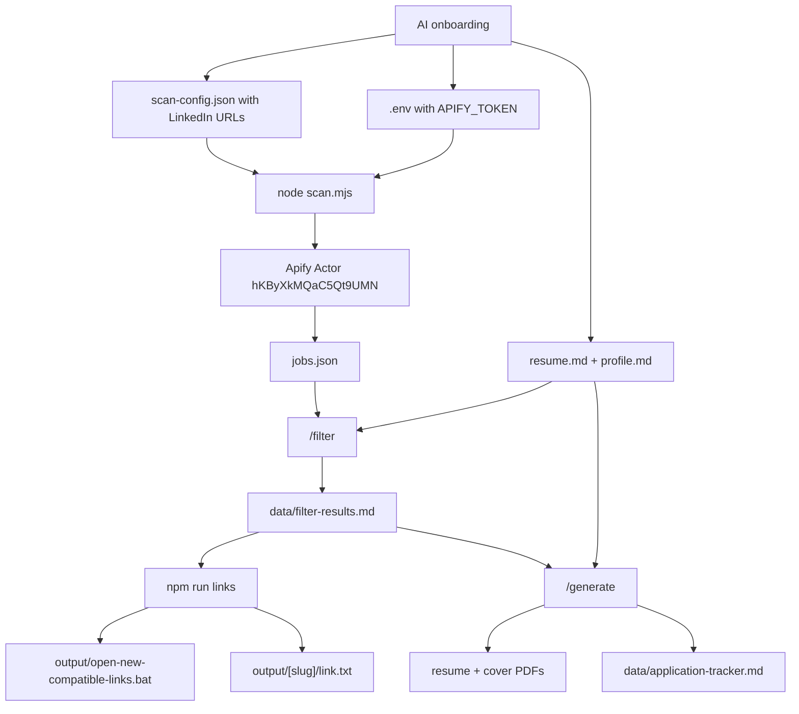

<div align="center">

# job-scout-agent

### AI-assisted LinkedIn job discovery, fit filtering, and tailored application prep

Turn Codex, OpenCode, Claude Code, or another AI coding agent into a private job-search assistant that scans LinkedIn with Apify, filters roles against your profile, prepares tailored resumes and cover letters, and opens only the newest compatible job links for human review.

Built through a vibe-coding workflow: fast AI-assisted iteration, human direction, and practical testing around a real job-search process.

<p>
  
  
  
  
  
</p>

</div>

---

## What This Is

`job-scout-agent` is an English-first template for a private, AI-assisted job search workflow.

It helps you:

- onboard a candidate profile through an AI agent
- save private career data locally
- generate LinkedIn search URLs from target roles and locations
- run the Apify LinkedIn Jobs Scraper Actor
- deduplicate and store jobs in `jobs.json`
- filter jobs against `resume.md` and `profile.md`
- export only newly compatible jobs to `output/`
- create a Windows `.bat` file that opens only the latest compatible LinkedIn links
- generate tailored resume and cover-letter PDFs
- track what was generated, opened, applied, rejected, or closed

> This is not an auto-apply bot. It prepares, filters, and organizes. You decide what to submit.

---

## Inspired By Career-Ops

This project is inspired by [santifer/career-ops](https://github.com/santifer/career-ops), a public AI-powered job search system that turns AI coding CLIs into a job-search command center.

Career-Ops provides ideas such as:

- structured fit evaluation
- ATS-friendly PDF generation
- agent-driven workflows
- batch processing with sub-agents
- tracker-first job search operations
- human-in-the-loop decision making

`job-scout-agent` takes a different route:

| Area | Career-Ops | job-scout-agent |
|------|------------|-------------|
| Job discovery | Scans portals such as Greenhouse, Ashby, Lever, and company pages | Scans LinkedIn search URLs through Apify |
| Browser automation | Uses Playwright for portal navigation and PDF generation | Uses Playwright only for PDF generation |
| Applying | Does not encourage blind auto-apply | Never submits applications automatically |
| Link handling | Pipeline/tracker driven | Creates `output/open-new-compatible-links.bat` for newly compatible LinkedIn links |
| Data source | Job portals and pasted URLs | Apify Actor `hKByXkMQaC5Qt9UMN` |
| Setup style | Rich career operations system | Lightweight reusable template for multiple AI coding agents |

This repo is an independent project, not a fork.

---

## Built With Vibe Coding

`job-scout-agent` was created through vibe coding: an iterative collaboration between a human and AI coding agents, using the project itself as the test case.

That shaped a few design choices:

- keep the workflow understandable by multiple AI coding tools
- make onboarding explicit instead of hiding assumptions in code
- keep private user data local by default
- prefer human-in-the-loop review over automatic submission
- optimize for a practical job-search loop rather than a polished SaaS experience

---

## Architecture



---

## Project Structure

```text
job-scout-agent/
  .agents/                    # Local agent skills for Codex-style environments
  .claude/                    # Claude Code skill definitions
  .github/                    # GitHub Actions, issue templates, PR template
  .opencode/commands/         # OpenCode slash commands
  data/                       # Private runtime state, ignored by Git
  instructions/               # Agent-readable workflow instructions
  output/                     # Generated applications and link batches, ignored by Git
  templates/                  # HTML resume and cover-letter templates
  AGENTS.md                   # Main model-neutral agent instructions
  CLAUDE.md                   # Claude Code entrypoint
  README.md                   # Project documentation
  scan.mjs                    # Apify scan runner
  sync-output-links.mjs       # Exports newly compatible job links to output/
  mark-applied.mjs            # Marks jobs as already applied
  generate-pdf.mjs            # HTML to PDF rendering with Playwright
  clean.mjs                   # Resets local runtime state
```

Private local files created during onboarding:

```text
.env                         # Apify token
resume.md                    # Candidate source of truth
profile.md                   # Job preferences and output language
jobs.json                    # Scanned LinkedIn jobs
scan-config.json             # Generated Apify Actor input
```

---

## AI Compatibility

| Tool | Entry Point |
|------|-------------|
| Codex | `AGENTS.md` |
| OpenCode | `AGENTS.md` + `.opencode/commands/` |
| Claude Code | `CLAUDE.md`, which points back to `AGENTS.md` |
| Other coding agents | Start from `AGENTS.md` |

OpenCode commands:

- `/onboarding`
- `/scan`
- `/filter`
- `/generate`
- `/tracker`
- `/contact`

Agents without slash commands can follow the same files manually.

---

## First Run

Install dependencies:

```bash
npm install
npx playwright install chromium
```

Then open the folder with your AI coding agent and ask:

```text
Start onboarding for this project.
```

The AI should:

1. ask for your Apify API token first
2. save it only in local `.env`
3. ask for your resume/career details
4. ask for job preferences and desired output language
5. generate LinkedIn search URLs from your target roles and locations
6. save those URLs in local `scan-config.json`
7. create initial private runtime files
8. ask whether to start the first scan

The Apify Actor used by this template:

```text
https://console.apify.com/actors/hKByXkMQaC5Qt9UMN/input
```

Apify can be used for initial tests without paying if you stay within the monthly free usage credit. At the time this template was created, Apify's free plan included about **$5/month** of platform usage credit. Keep first scans small: use fewer search URLs and a lower `count` while testing.

---

## Manual Setup

If you prefer creating files yourself:

```bash
cp .env.example .env
cp resume.example.md resume.md
cp profile.example.md profile.md
cp jobs.example.json jobs.json
cp scan-config.example.json scan-config.json
node clean.mjs
```

Then edit:

- `.env`
- `resume.md`
- `profile.md`
- `scan-config.json`

---

## Workflow

### 1. Scan LinkedIn

```bash
node scan.mjs
```

This starts the Apify Actor, waits for completion, downloads the dataset, deduplicates jobs, and updates:

```text
jobs.json
data/scan-history.json
```

The Actor input sent by `scan.mjs` has this shape:

```json
{
  "count": 100,
  "scrapeCompany": true,
  "splitByLocation": false,
  "urls": [
    "https://www.linkedin.com/jobs/search/?keywords=<encoded-keywords>&location=<encoded-location>&position=1&pageNum=0"
  ]
}
```

For testing, start with a low `count` such as `25`, `50`, or `100`. Increase it only after confirming the workflow behaves as expected and your Apify usage is still within budget.

### 2. Filter Jobs

Use the AI command:

```text
/filter
```

The agent reads:

```text
resume.md
profile.md
jobs.json
instructions/filter.md
```

and appends results to:

```text
data/filter-results.md
```

### 3. Export New Compatible Links

```bash
npm run links
```

This creates or updates:

```text
output/[slug]/link.txt
output/open-new-compatible-links.bat
output/new-compatible-links.md
output/compatible-links.md
data/output-links-state.json
```

The `.bat` opens only compatible links newly added in the latest run.

Jobs are skipped if they are:

- already exported in `data/output-links-state.json`
- marked in `data/applied-jobs.json`
- marked as applied/submitted/sent/rejected/closed in `data/application-tracker.md`

After applying manually, mark a job locally:

```bash
npm run applied -- <job-id-or-company-slug>
```

### 4. Generate Resume + Cover Letter

Use the AI command:

```text
/generate
```

For each selected `PROCEED` job, the system creates:

```text
output/[slug]/
  resume-[slug].html
  resume-[slug].pdf
  cover-[slug].html
  cover-[slug].pdf
  link.txt
```

### 5. Track Status

Use:

```text
/tracker
```

The tracker lives in:

```text
data/application-tracker.md
```

---

## Private Files

These are ignored by Git and should never be committed:

```text
.env
resume.md
profile.md
jobs.json
scan-config.json
data/*
output/*
```

Historical/local files from this workspace are also ignored:

```text
cv.md
profilo.md
offerte.json
gen2.mjs
gen3.mjs
gen-agent*.mjs
gen-batch-*.py
generate-batch-*.mjs
output.zip
node_modules/
```

---

## Public Template Files

Useful examples included in the repo:

```text
.env.example
resume.example.md
profile.example.md
jobs.example.json
scan-config.example.json
```

---

## Data Contract

`jobs.json` is an array of LinkedIn job objects. The workflow relies mostly on:

| Field | Purpose |
|-------|---------|
| `id` | stable job ID |
| `title` | job title |
| `companyName` | company name |
| `location` | job location |
| `link` | LinkedIn/job URL |
| `descriptionText` | clean job description text |
| `seniorityLevel` | seniority signal |
| `employmentType` | full-time, contract, internship, etc. |
| `workplaceTypes` | remote, hybrid, on-site |
| `workRemoteAllowed` | remote boolean |
| `expireAt` | expiry timestamp |
| `postedAt` | posting date |
| `applicantsCount` | competition signal |
| `salary` | compensation text, when available |
| `jobPosterName` | recruiter name, when available |
| `jobPosterTitle` | recruiter title, when available |
| `jobPosterProfileUrl` | recruiter LinkedIn URL |
| `companyWebsite` | company website |

Use `descriptionText`, not `descriptionHtml`.

---

## Commands

```bash
npm install
npx playwright install chromium
node scan.mjs
npm run links
npm run applied -- <job-id-or-company-slug>
node generate-pdf.mjs <input.html> <output.pdf> [--format=letter|a4]
npm run pdf
node clean.mjs
```

---

## Design Principles

- Human decides, AI assists.
- Quality over volume.
- No automatic application submission.
- No invented resume facts.
- Private data stays local.
- LinkedIn scanning uses Apify only.
- Generated materials adapt to the user's preferred language.

---

## About the Author

Created by **David Popescu** as a practical vibe-coding experiment around AI-assisted job search, local-first automation, and agent-driven workflows.

Portfolio: [popifix.it](https://www.popifix.it)

The project reflects a few personal interests:

- using AI agents as practical workflow partners, not just chat interfaces
- turning repetitive career tasks into inspectable local automation
- keeping sensitive career data private by default
- building tools that assist decisions without replacing human judgment
- exploring how Codex, OpenCode, Claude Code, and similar tools can share one project contract

If this project helps you, a GitHub star is appreciated. It makes the project easier for other job seekers and AI-tool builders to discover.
