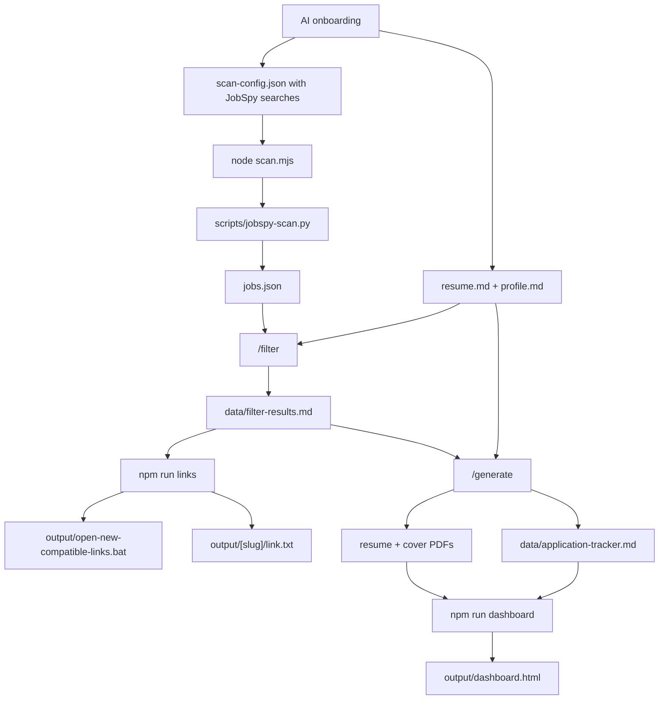

<div align="center">

# job-scout-agent

### AI-assisted job discovery, fit filtering, and tailored application prep

Turn Codex, OpenCode, Claude Code, or another AI coding agent into a private job-search assistant that scans job boards with JobSpy, filters roles against your profile, prepares tailored resumes and cover letters, and opens a local dashboard for human review.

Built through a vibe-coding workflow: fast AI-assisted iteration, human direction, and practical testing around a real job-search process.

<p>
  
  
  
  
  
</p>

</div>

---

## What This Is

`job-scout-agent` is an English-first template for a private, AI-assisted job search workflow.

It helps you:

- onboard a candidate profile through an AI agent
- save private career data locally
- configure JobSpy searches from target roles and locations
- scan LinkedIn, Indeed, and Google Jobs by default
- deduplicate and store jobs in `jobs.json`
- filter jobs against `resume.md` and `profile.md`
- export only newly compatible jobs to `output/`
- create a Windows `.bat` file that opens only the latest compatible job links
- generate tailored resume and cover-letter PDFs
- build a static dashboard with job links and PDF downloads
- track what was generated, opened, applied, rejected, or closed

> This is not an auto-apply bot. It prepares, filters, and organizes. You decide what to submit.

---

## Inspired By Career-Ops

This project is inspired by [santifer/career-ops](https://github.com/santifer/career-ops), a public AI-powered job search system that turns AI coding CLIs into a job-search command center.

Career-Ops provides ideas such as:

- structured fit evaluation
- ATS-friendly PDF generation
- agent-driven workflows
- batch processing with sub-agents
- tracker-first job search operations
- human-in-the-loop decision making

`job-scout-agent` takes a different route:

| Area | Career-Ops | job-scout-agent |
|------|------------|-------------|
| Job discovery | Scans portals such as Greenhouse, Ashby, Lever, and company pages | Scans LinkedIn, Indeed, and Google Jobs through JobSpy |
| Browser automation | Uses Playwright for portal navigation and PDF generation | Uses Playwright only for PDF generation |
| Applying | Does not encourage blind auto-apply | Never submits applications automatically |
| Link handling | Pipeline/tracker driven | Creates `output/open-new-compatible-links.bat` for newly compatible job links |
| Data source | Job portals and pasted URLs | JobSpy normalized into `jobs.json` |
| Setup style | Rich career operations system | Lightweight reusable template for multiple AI coding agents |

This repo is an independent project, not a fork.

---

## Built With Vibe Coding

`job-scout-agent` was created through vibe coding: an iterative collaboration between a human and AI coding agents, using the project itself as the test case.

That shaped a few design choices:

- keep the workflow understandable by multiple AI coding tools
- make onboarding explicit instead of hiding assumptions in code
- keep private user data local by default
- prefer human-in-the-loop review over automatic submission
- optimize for a practical job-search loop rather than a polished SaaS experience

---

## Architecture



---

## Project Structure

```text
job-scout-agent/
  .agents/                    # Local agent skills for Codex-style environments
  .claude/                    # Claude Code skill definitions
  .github/                    # GitHub Actions, issue templates, PR template
  .opencode/commands/         # OpenCode slash commands
  data/                       # Private runtime state, ignored by Git
  instructions/               # Agent-readable workflow instructions
  output/                     # Generated applications and link batches, ignored by Git
  templates/                  # HTML resume and cover-letter templates
  AGENTS.md                   # Main model-neutral agent instructions
  CLAUDE.md                   # Claude Code entrypoint
  README.md                   # Project documentation
  scripts/jobspy-scan.py      # Python JobSpy bridge
  scan.mjs                    # JobSpy scan runner
  sync-output-links.mjs       # Exports newly compatible job links to output/
  dashboard.mjs               # Builds output/dashboard.html
  mark-applied.mjs            # Marks jobs as already applied
  generate-pdf.mjs            # HTML to PDF rendering with Playwright
  clean.mjs                   # Resets local runtime state
```

Private local files created during onboarding:

```text
.env                         # Optional local environment overrides
resume.md                    # Candidate source of truth
profile.md                   # Job preferences and output language
jobs.json                    # Scanned jobs
scan-config.json             # Local JobSpy search config
```

---

## AI Compatibility

| Tool | Entry Point |
|------|-------------|
| Codex | `AGENTS.md` |
| OpenCode | `AGENTS.md` + `.opencode/commands/` |
| Claude Code | `CLAUDE.md`, which points back to `AGENTS.md` |
| Other coding agents | Start from `AGENTS.md` |

OpenCode commands:

- `/onboarding`
- `/scan`
- `/filter`
- `/generate`
- `/tracker`
- `/contact`

Agents without slash commands can follow the same files manually.

---

## First Run

Install dependencies:

```bash
npm install
python -m pip install -r requirements.txt
npx playwright install chromium
```

Then open the folder with your AI coding agent and ask:

```text
Start onboarding for this project.
```

The AI should:

1. ask for your resume/career details
2. ask for job preferences and desired output language
3. ask for JobSpy search keywords, locations, sites, and limits
4. save those searches in local `scan-config.json`
5. create initial private runtime files
6. ask whether to start the first scan

JobSpy does not require an API token by default. For first scans, keep `resultsWanted` low, such as `10`, `25`, or `50` per search.

---

## Manual Setup

If you prefer creating files yourself:

```bash
cp .env.example .env
cp resume.example.md resume.md
cp profile.example.md profile.md
cp jobs.example.json jobs.json
cp scan-config.example.json scan-config.json
node clean.mjs
```

Then edit:

- `resume.md`
- `profile.md`
- `scan-config.json`

---

## Workflow

### 1. Scan Jobs

```bash
node scan.mjs
```

This runs JobSpy through the Python bridge, normalizes results, deduplicates jobs, and updates:

```text
jobs.json
data/scan-history.json
```

Jobs whose IDs are already present in `jobs.json`, `data/scan-history.json`, `data/filter-progress.json`, or `data/applied-jobs.json` are skipped automatically so repeated scans do not reintroduce already handled offers.

The JobSpy config read by `scan.mjs` has this shape:

```json
{
  "provider": "jobspy",
  "sites": ["linkedin", "indeed", "google"],
  "countryIndeed": "Italy",
  "resultsWanted": 25,
  "hoursOld": 168,
  "searches": [
    {
      "searchTerm": "software engineer",
      "googleSearchTerm": "software engineer jobs near Italy since last week",
      "location": "Italy"
    }
  ]
}
```

For testing, start with a low `resultsWanted` such as `10`, `25`, or `50`. Increase it only after confirming the workflow behaves as expected.

### 2. Filter Jobs

Use the AI command:

```text
/filter
```

The agent reads:

```text
resume.md
profile.md
jobs.json
instructions/filter.md
```

and appends results to:

```text
data/filter-results.md
```

When subagents are available, the main agent acts as a coordinator: it sends one worker subagent the next 40 unfiltered jobs, reviews the worker's rows and micro-summary, saves progress, runs `npm run links`, and continues until the list is complete. At the end it reports one aggregate summary across all worker batches.

### 3. Export New Compatible Links

```bash
npm run links
```

This creates or updates:

```text
output/[slug]/link.txt
output/open-new-compatible-links.bat
output/new-compatible-links.md
output/compatible-links.md
data/output-links-state.json
```

The `.bat` opens only compatible links newly added in the latest run.

Jobs are skipped if they are:

- already exported in `data/output-links-state.json`
- marked in `data/applied-jobs.json`
- marked as applied/submitted/sent/rejected/closed in `data/application-tracker.md`

After applying manually, mark a job locally:

```bash
npm run applied -- <job-id-or-company-slug>
```

### 4. Generate Resume + Cover Letter

Use the AI command:

```text
/generate
```

For each selected `PROCEED` job, the system creates:

```text
output/[slug]/
  resume-[slug].html
  resume-[slug].pdf
  cover-[slug].html
  cover-[slug].pdf
  link.txt
```

### 5. Build Dashboard

```bash
npm run dashboard
```

This creates:

```text
output/dashboard.html
```

Open it locally to review compatible applications, job links, and available resume/cover-letter PDF downloads. Missing PDFs are shown as missing instead of breaking the page. Clicking a card marks it as opened in local browser storage; once at least one PDF exists, the card can be marked checked.

### 6. Track Status

Use:

```text
/tracker
```

The tracker lives in:

```text
data/application-tracker.md
```

---

## Private Files

These are ignored by Git and should never be committed:

```text
.env
resume.md
profile.md
jobs.json
scan-config.json
data/*
output/*
```

Historical/local files from this workspace are also ignored:

```text
cv.md
profilo.md
offerte.json
gen2.mjs
gen3.mjs
gen-agent*.mjs
gen-batch-*.py
generate-batch-*.mjs
output.zip
node_modules/
```

---

## Public Template Files

Useful examples included in the repo:

```text
.env.example
resume.example.md
profile.example.md
jobs.example.json
scan-config.example.json
```

---

## Data Contract

`jobs.json` is an array of normalized JobSpy job objects. The workflow relies mostly on:

| Field | Purpose |
|-------|---------|
| `id` | stable job ID |
| `title` | job title |
| `companyName` | company name |
| `location` | job location |
| `link` | LinkedIn/job URL |
| `descriptionText` | clean job description text |
| `seniorityLevel` | seniority signal |
| `employmentType` | full-time, contract, internship, etc. |
| `workplaceTypes` | remote, hybrid, on-site |
| `workRemoteAllowed` | remote boolean |
| `expireAt` | expiry timestamp |
| `postedAt` | posting date |
| `applicantsCount` | competition signal |
| `salary` | compensation text, when available |
| `jobPosterName` | recruiter name, when available |
| `jobPosterTitle` | recruiter title, when available |
| `jobPosterProfileUrl` | recruiter LinkedIn URL |
| `companyWebsite` | company website |
| `source` | source site, such as linkedin, indeed, or google |

Use `descriptionText`, not `descriptionHtml`.

---

## Commands

```bash
npm install
python -m pip install -r requirements.txt
npx playwright install chromium
node scan.mjs
npm run links
npm run dashboard
npm run applied -- <job-id-or-company-slug>
node generate-pdf.mjs <input.html> <output.pdf> [--format=letter|a4]
npm run pdf
node clean.mjs
```

---

## Design Principles

- Human decides, AI assists.
- Quality over volume.
- No automatic application submission.
- No invented resume facts.
- Private data stays local.
- Job scanning uses JobSpy by default.
- Generated materials adapt to the user's preferred language.

---

## About the Author

Created by **David Popescu** as a practical vibe-coding experiment around AI-assisted job search, local-first automation, and agent-driven workflows.

Portfolio: [popifix.it](https://www.popifix.it)

The project reflects a few personal interests:

- using AI agents as practical workflow partners, not just chat interfaces
- turning repetitive career tasks into inspectable local automation
- keeping sensitive career data private by default
- building tools that assist decisions without replacing human judgment
- exploring how Codex, OpenCode, Claude Code, and similar tools can share one project contract

If this project helps you, a GitHub star is appreciated. It makes the project easier for other job seekers and AI-tool builders to discover.
